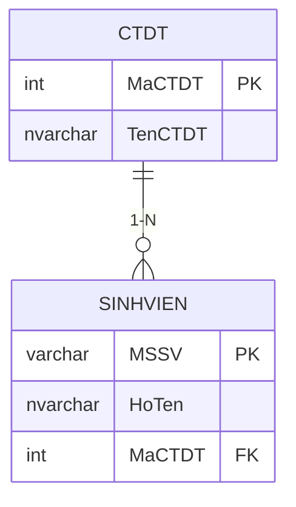

# PHASE 2 – BACKEND (DATABASE & LOGIC)

## 1. Mục tiêu
Thiết kế cơ sở dữ liệu MySQL và xây dựng lớp truy cập dữ liệu (Data Access Layer) bằng C# với ADO.NET (`MySql.Data`).

---

## 2. Database Schema

### 2.1 Bảng `CTDT` (Chương trình đào tạo)

```sql
CREATE TABLE CTDT (
    MaCTDT  INT AUTO_INCREMENT PRIMARY KEY,
    TenCTDT NVARCHAR(100) NOT NULL
);
```

| Cột | Kiểu | Ràng buộc | Mô tả |
|---|---|---|---|
| `MaCTDT` | INT | PK, AUTO_INCREMENT | Mã chương trình |
| `TenCTDT` | NVARCHAR(100) | NOT NULL | Tên chương trình |

### 2.2 Bảng `SINHVIEN`

```sql
CREATE TABLE SINHVIEN (
    MSSV    VARCHAR(20) PRIMARY KEY,
    HoTen   NVARCHAR(100) NOT NULL,
    MaCTDT  INT NOT NULL,
    FOREIGN KEY (MaCTDT) REFERENCES CTDT(MaCTDT)
);
```

| Cột | Kiểu | Ràng buộc | Mô tả |
|---|---|---|---|
| `MSSV` | VARCHAR(20) | PK | Mã số sinh viên |
| `HoTen` | NVARCHAR(100) | NOT NULL | Họ và tên |
| `MaCTDT` | INT | FK → CTDT | Liên kết CTDT |

### 2.3 Dữ liệu mẫu

```sql
INSERT INTO CTDT (TenCTDT) VALUES
    ('CTC - Chính quy Truyền thống'),
    ('CLC - Chất lượng cao'),
    ('CNTT - Công nghệ Thông tin'),
    ('KTPM - Kỹ thuật Phần mềm');
```

### 2.4 Diagram quan hệ



---

## 3. Connection String

```
Server=localhost; Port=3306; Database=DS_SINH_VIEN; Uid=root; Pwd=;
CharSet=utf8mb4;
```

> ⚠️ Cần thay đổi `Pwd` nếu MySQL có mật khẩu.

---

## 4. DatabaseHelper Class

### 4.1 Tổng quan

```
DatabaseHelper (static class)
├── ConnectionString          → const string
├── GetConnection()           → MySqlConnection
├── LoadCTDT()                → List<CTDT>
├── LoadSinhVien()            → List<SinhVien>
└── ThemSinhVien(mssv, hoten, mactdt) → bool
```

### 4.2 Chi tiết từng phương thức

#### `GetConnection()`
```
- Tạo mới MySqlConnection(ConnectionString)
- Gọi Open()
- Return connection
- Nếu lỗi → throw exception kèm message rõ ràng
```

#### `LoadCTDT()`
```
SQL: SELECT MaCTDT, TenCTDT FROM CTDT ORDER BY MaCTDT
- Mở connection
- ExecuteReader
- Duyệt reader → tạo List<CTDT>
- Đóng connection
- Return list
```

#### `LoadSinhVien()`
```
SQL: SELECT sv.MSSV, sv.HoTen, sv.MaCTDT, ct.TenCTDT
     FROM SINHVIEN sv
     INNER JOIN CTDT ct ON sv.MaCTDT = ct.MaCTDT
     ORDER BY sv.MSSV
- Mở connection
- ExecuteReader
- Duyệt reader → tạo List<SinhVien>
- Đóng connection
- Return list
```

#### `ThemSinhVien(string mssv, string hoten, int maCTDT)`
```
SQL: INSERT INTO SINHVIEN (MSSV, HoTen, MaCTDT) VALUES (@mssv, @hoten, @mactdt)
- Sử dụng parameterized query (chống SQL Injection)
- Mở connection
- ExecuteNonQuery
- Đóng connection
- Return true nếu rows affected > 0
- Catch exception → return false hoặc throw
```

---

## 5. Xử lý lỗi

| Tình huống | Xử lý |
|---|---|
| Không kết nối được MySQL | MessageBox thông báo lỗi, hướng dẫn kiểm tra MySQL service |
| Trùng MSSV (Duplicate PK) | MessageBox "MSSV đã tồn tại!" |
| CTDT không hợp lệ (FK fail) | MessageBox thông báo chọn CTDT hợp lệ |
| Exception khác | MessageBox hiển thị chi tiết lỗi |

---

## 6. Files cần tạo (Phase này)

| # | File | Mô tả |
|---|---|---|
| 1 | `database.sql` | Script tạo DB + bảng + dữ liệu mẫu |
| 2 | `DatabaseHelper.cs` | Static class kết nối & thao tác MySQL |

---

## 7. Checklist

- [x] Viết `database.sql` (CREATE DATABASE, CREATE TABLE × 2, INSERT dữ liệu mẫu)
- [x] Tạo `DatabaseHelper.cs` với `GetConnection()`
- [x] Implement `LoadCTDT()`
- [x] Implement `LoadSinhVien()` (có JOIN)
- [x] Implement `ThemSinhVien()` (parameterized query)
- [x] Test kết nối trên máy Windows có MySQL
