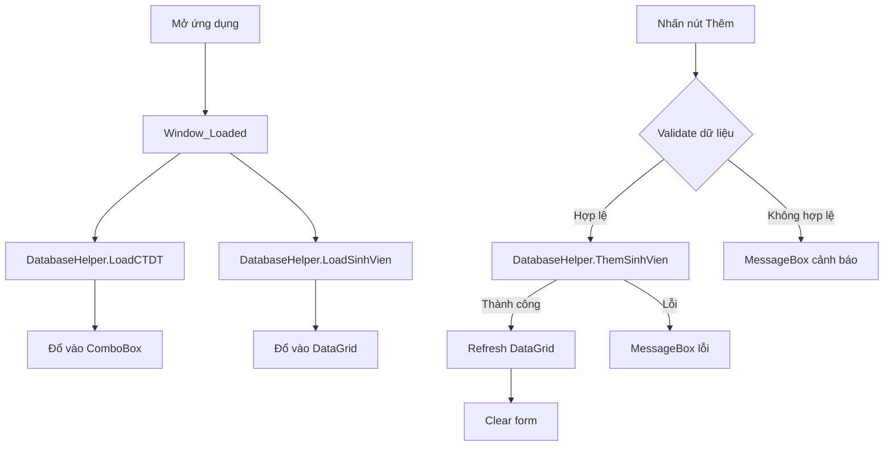

# PHASE 3 – TÍCH HỢP & KIỂM THỬ

## 1. Mục tiêu
Ghép nối Frontend (Phase 1) với Backend (Phase 2), kiểm thử toàn bộ chức năng, và hoàn thiện ứng dụng.

---

## 2. Quy trình tích hợp

### 2.1 Sơ đồ luồng dữ liệu



### 2.2 Bước ghép nối

| # | Bước | Chi tiết |
|---|---|---|
| 1 | Thêm NuGet `MySql.Data` | Đảm bảo `.csproj` đã khai báo PackageReference |
| 2 | Kết nối `Window_Loaded` | Gọi `DatabaseHelper.LoadCTDT()` → `cbCTDT.ItemsSource` |
| 3 | Kết nối `Window_Loaded` | Gọi `DatabaseHelper.LoadSinhVien()` → `dgSinhVien.ItemsSource` |
| 4 | Kết nối `btnThem_Click` | Validate → `DatabaseHelper.ThemSinhVien()` → Refresh |
| 5 | Xử lý lỗi | try-catch bọc tất cả lời gọi DB |

---

## 3. Kịch bản kiểm thử

### 3.1 Test kết nối Database

| # | Test Case | Input | Expected |
|---|---|---|---|
| TC01 | MySQL đang chạy, DB tồn tại | Mở app | ComboBox có 4 CTDT, DataGrid rỗng (hoặc có data) |
| TC02 | MySQL tắt | Mở app | MessageBox báo lỗi kết nối |
| TC03 | Sai password | Mở app | MessageBox báo lỗi authentication |

### 3.2 Test Load ComboBox

| # | Test Case | Expected |
|---|---|---|
| TC04 | Load danh sách CTDT | ComboBox hiện: CTC, CLC, CNTT, KTPM |
| TC05 | Chọn từng mục | SelectedValue trả về MaCTDT tương ứng |

### 3.3 Test Thêm sinh viên

| # | Test Case | Input | Expected |
|---|---|---|---|
| TC06 | Thêm thành công | MSSV=SV001, Họ Tên=Nguyễn Văn A, CTDT=CLC | Dòng mới trong DataGrid + MessageBox thành công |
| TC07 | Bỏ trống MSSV | MSSV=(rỗng) | MessageBox "Vui lòng nhập MSSV" |
| TC08 | Bỏ trống Họ Tên | HoTen=(rỗng) | MessageBox "Vui lòng nhập Họ Tên" |
| TC09 | Chưa chọn CTDT | CTDT=(chưa chọn) | MessageBox "Vui lòng chọn CTDT" |
| TC10 | Trùng MSSV | MSSV=SV001 (đã tồn tại) | MessageBox "MSSV đã tồn tại" |
| TC11 | MSSV có ký tự đặc biệt | MSSV=SV'001 | Không bị SQL Injection, insert an toàn hoặc báo lỗi |

### 3.4 Test DataGrid

| # | Test Case | Expected |
|---|---|---|
| TC12 | Sau khi thêm SV | DataGrid refresh, hiển thị dòng mới |
| TC13 | Hiển thị TenCTDT | Cột CTDT hiện tên (VD: "CLC") thay vì mã số |

---

## 4. Hướng dẫn chạy ứng dụng

### Bước 1: Chuẩn bị MySQL
```bash
# Đăng nhập MySQL
mysql -u root -p

# Chạy script tạo DB
source /path/to/database.sql;
```

### Bước 2: Mở project trong Visual Studio
1. Mở `DS_SINH_VIEN.csproj` bằng Visual Studio 2022
2. NuGet sẽ tự restore `MySql.Data`
3. Kiểm tra connection string trong `DatabaseHelper.cs`

### Bước 3: Build & Run
```
Ctrl + F5 (Start Without Debugging)
```

### Bước 4: Kiểm thử
- Chạy từng Test Case ở mục 3 ở trên

---

## 5. Checklist hoàn thiện

- [ ] Chạy `database.sql` thành công trên MySQL
- [ ] Build project không lỗi trong Visual Studio
- [ ] TC01–TC03: Test kết nối DB ✓
- [ ] TC04–TC05: Test ComboBox ✓
- [ ] TC06–TC11: Test thêm sinh viên ✓
- [ ] TC12–TC13: Test DataGrid ✓
- [x] Code sạch, có comment giải thích
- [x] Bàn giao source code hoàn chỉnh
